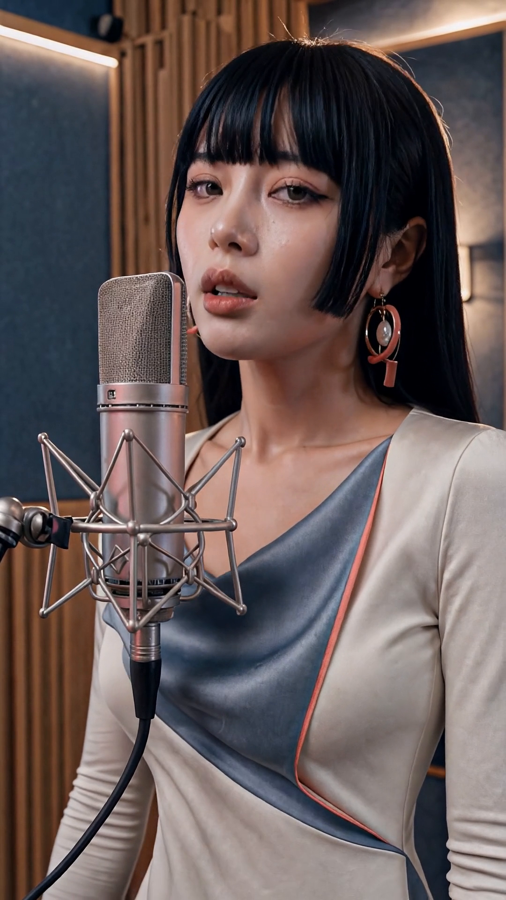
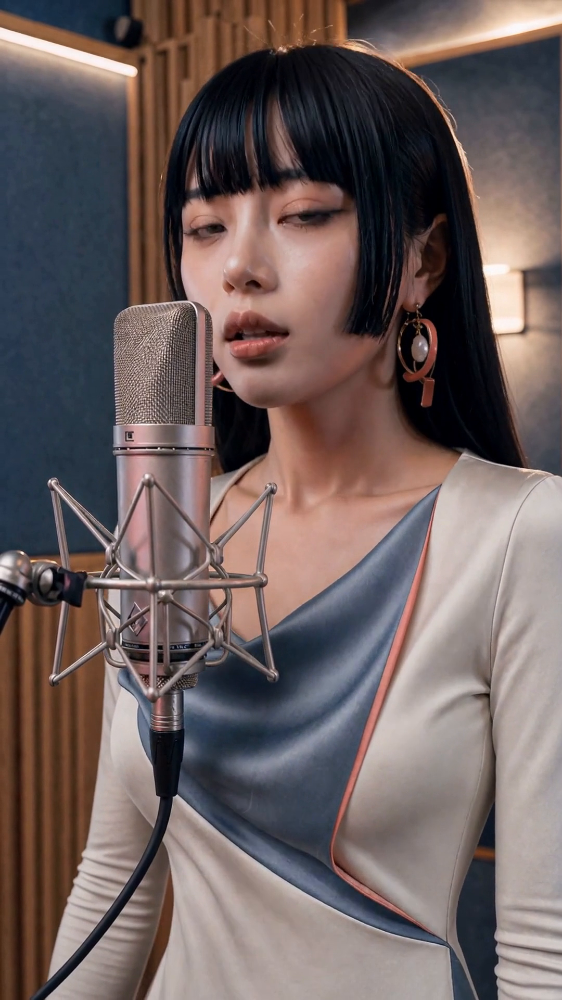
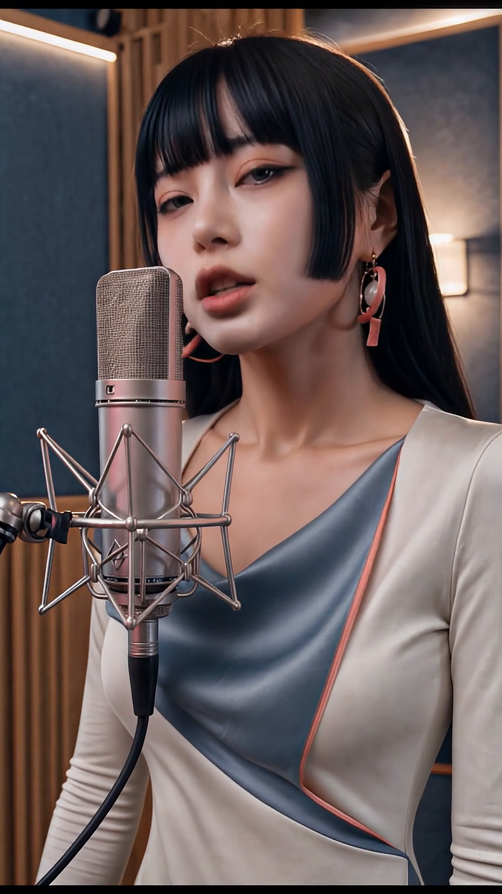

# 音乐影像实验室 · Music Video Lab

**从真实音乐视频制作出发，公开工作流、对照样片、失败记录和实际成本。**

我们持续制作音乐影像，研究怎样把已经完成的歌曲、人物图片和镜头意图，变成可以交给剪辑的片段。叁和三界KTV是实际案例；研究范围还会延伸到表情、多人互动、分镜与新模型。

2026-09-12更新：[工作流库](docs/workflow-library.md)现在提供两个入口：单人唱歌与精确交付、通用H3镜头准备。通用版默认同样为864×1536原生，加入首帧配音频/静音的明确用法和实际图检查。本次是离线整理，没有新增付费生成或公开媒体。模型、节点与基础配方来自MiniMax、T8star-Aix及其他开源作者；我们的工作是场景适配、同素材比较、实际交付检查和经验记录。

- **按原曲唱歌并交给剪辑**：[生产与交付指南](docs/h3-production.md)。
- **做反应、互动或不同表演镜头**：[通用H3指南](docs/h3-shots.md)、[配方](recipes/h3-shot.json)、[准备与检查工具](tools/prepare_shot.py)。具体表演仍需看片，新模式的跨账号生成尚未验证。

## 新增：可复跑的单人唱歌生产版

[从这里开始：H3生产与交付指南](docs/h3-production.md)。输入图片、人声和同段原曲，使用864原生＋FFN4内部计算分批，下载后一次普通放大、30fps适配与最小裁尾，得到1080片段。

- [生成API图](workflows/h3-singing-production.api.json)、[配方](recipes/h3-singing-production.json)与中性演唱提示。
- [按人声长度准备图](tools/prepare_singing.py)、[原曲与1080交付工具](tools/finalize_singing.py)。Python标准库，整理视频另需FFmpeg/FFprobe；不自动提交付费任务。
- [第二批13次尝试](data/h3-production-batch-002.json)：4次显存失败，8段FFN4/24G＋1段原方案/48G，9段技术交付共708 RH币。人工时间和最终采用率没有测全，不能作为固定报价或普遍成功率。

这次不新增视频素材。下方图库保留第一轮历史对照，不能把这些旧样片当成FFN4新配方的同素材消融。当前公开API图没有鼠标画布布局，跨账号生成尚未验证；完整边界见指南。

## 先看结果

| 同一段《药》，9.2秒 | 高清尺寸整理后 | 同日生产基线 |
|---|---|---|
| [](assets/videos/singing-flash.mp4) | [](assets/videos/singing-high.mp4) | [](assets/videos/singing-wan.mp4) |
| H3生成29＋FlashVSR43＝**72 RH币** | H3原生864×1536，再普通放大到1080：**54 RH币** | Wan＋InfiniteTalk＋FlashVSR：**190 RH币** |

点击图片进入对应视频文件。完整下载仓库后，双击 [gallery.html](gallery.html) 可并排播放、查看原生与超分前后的静帧。GitHub的源码预览不会执行这个HTML。

**72币是这次两项任务的实扣之和，不是H3官方2K超分，也不是已经发布的一键融合应用。** 三者的输出帧率、质感和最终可用率并不相等。价格是历史样本，不能直接推成同质量生产报价。

- **唱歌**：H3已有值得听看嘴形的候选；接回同一原曲，没有平移音频去修同步。逐字口型还需要人审。
- **超分**：本例耳环和麦克风更清楚，但脸部可能更有加工感。新增细节不必然是真实细节。
- **表情与互动**：浅笑、大笑、近侧手扶肩有可挑片段；精确控制每个人的头和眼睛仍有缺口。
- **失败也公开**：双采样例生成了假字幕；更复杂的配方没有自动更好。

## 从哪里开始

1. [当前单人唱歌流程](docs/h3-production.md)：配方、准备、生成、下载后的交付与失败恢复。
2. [H3首轮公开报告](docs/h3-study.md)、[首轮复跑说明](docs/reproduce.md)：看历史对照与入口。
3. [检查自己的视频](docs/tools.md)：查帧数、时长，导出固定时刻截图；工具在本地运行，不调用付费生成。
4. [来源与贡献](docs/credits.md)、[许可范围](LICENSES.md)：上游贡献、代码与演示素材分开。

## 仓库里有什么

```text
docs/          方法、复跑步骤、限制与上游来源
recipes/       已测设置、镜头提示与超分参数
workflows/     根据已测接口重建的ComfyUI API图（不是鼠标画布JSON）
tools/         准备API图、普通放大与接原曲、时长检查、抽帧和离线看片页
tests/         时长边界及输入检查
data/          首轮19次任务与第二批13次尝试的公开字段、精选样本与哈希
assets/        少量短视频和固定时刻截图
```

当前公开工具只在本地准备、整理和检查，**不会拿到你的密钥，也不会替你发起付费生成**。RH跨账号部署、模型版本、节点兼容性仍需各自核对。我们还没有发布自己的RH一键应用。

## 交流

欢迎在 [Issues](https://github.com/clarowang/music-video-lab/issues) 留下可复现的问题：输入类型、使用的版本、参数、实际结果与预期。分享自己的示例前请确认素材可公开，别贴API密钥或私有下载地址。

后续优先沿真实制作问题继续研究：脸与配饰的不同增强收益、原曲口型、多人关系和分镜交付。结果成熟就补充，不承诺固定更新频率。

**English:** Production-grounded experiments for AI music videos: singing lip sync, expressions, multi-character shots, upscaling, failure cases and measured costs. Start with the [reproduction guide](docs/reproduce.md). This is a research snapshot, not a universal quality or speed benchmark.

代码与API图采用GPL-3.0-or-later；原创说明采用CC BY 4.0；展示媒体另行许可。请读 [LICENSES.md](LICENSES.md)。
